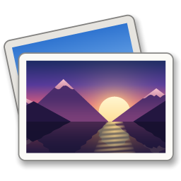
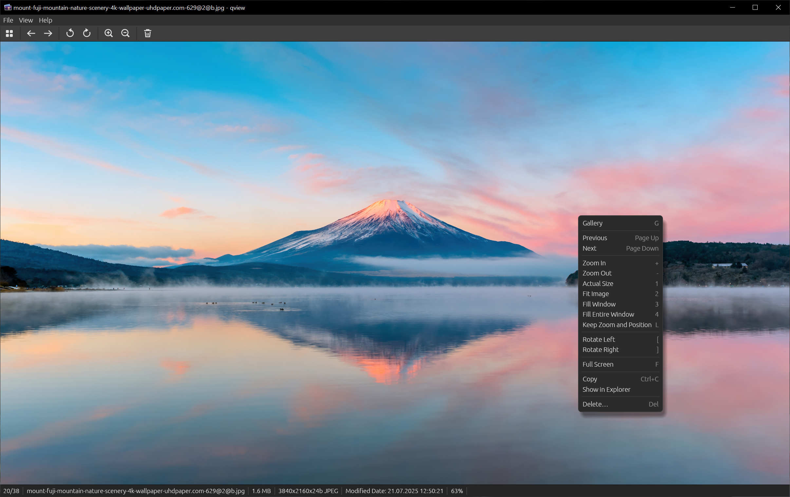
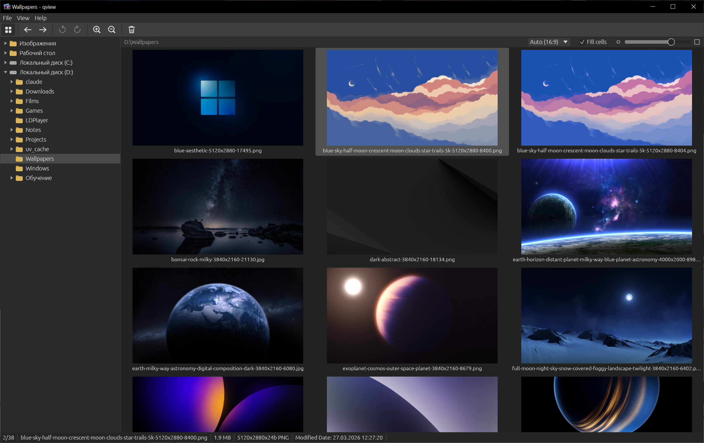
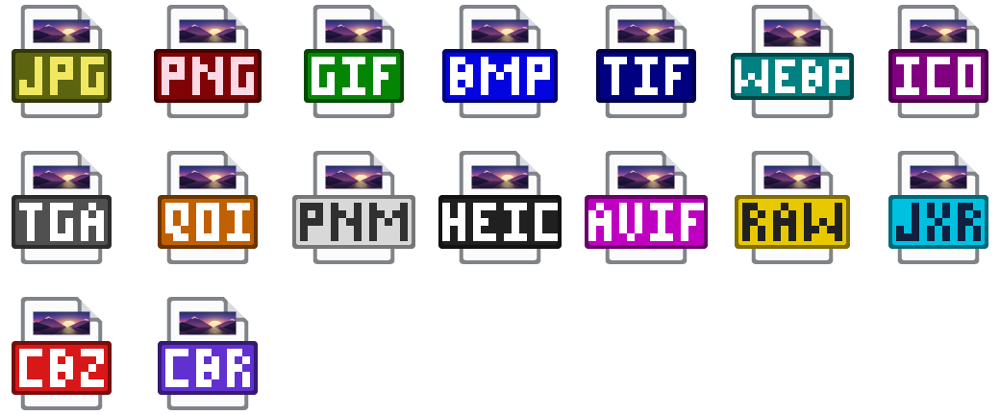

<p align="center">
  
</p>

<h1 align="center">qview</h1>

<p align="center">A fast and simple image viewer for Windows</p>

<p align="center">
  <a href="https://github.com/Fan4Metal/qview/releases/latest"></a>
  
  <a href="LICENSE"></a>
</p>

<p align="center"><b>English</b> | <a href="README.ru.md">Русский</a></p>

qview is a fast and simple image viewer for Windows. It opens an image in a fraction of a second, browses the other images of its folder without delays and has no settings dialog: the few options are in the menus.



*Screenshot of version 0.2.0; the toolbar of the current version has more buttons.*

## Features

- Start-up of about 0.2 s to the first image: decoding begins before the window is created and runs on background threads.
- Instant browsing: the neighbours of the current image are decoded in advance.
- Images are listed in the same order as in Explorer (numbers are compared as numbers); View → Sort orders them by date modified or size instead, ascending or descending.
- The gallery shows the folder tree and the images of a folder as thumbnails (see [Gallery](#gallery)).
- Images from any folders can be marked as favorites with `S` and then viewed and copied together (see [Favorites](#favorites)).
- Downscaled images are smoothed with mipmaps; 100% shows one image pixel per screen pixel at any Windows display scaling.
- The EXIF orientation of photos is applied.
- The status bar shows the position in the folder, the file name, size, dimensions, colour depth, format, modification date and zoom.
- Deletion moves the file to the Recycle Bin after a confirmation.
- File → Copy Image (`Ctrl+Shift+C`) puts the image on the clipboard as it is shown, rotated, flipped and, while cropping, cropped, at the full size of the file, for pasting into other programs; an image with transparency is also put there as PNG. File → Paste (`Ctrl+V`) opens what the clipboard holds: a file copied in Explorer, a path copied as text, or an image, such as a screenshot, which is saved as a PNG file named `Clipboard <date> <time>.png` in the `qview` folder of the temporary folder and can then be cropped and saved elsewhere with Save As.
- Images can be rotated, flipped and cropped and saved over the file or as another file; a JPEG that is only rotated or flipped keeps its compressed data (see [Rotating and cropping](#rotating-and-cropping)).
- The filtering of images not shown at 100% is chosen in View → Filtering: bilinear (the default), bicubic, which is sharper both when enlarging and when reducing, or pixelated, which shows every pixel of an enlarged image as a sharp square of the same size at any zoom and suits pixel art and screenshots.
- The background of the image area is chosen in View → Background: dark (the default), black, grey, white or any other colour. Transparent areas of an image are shown over a checkerboard, which can be turned off in the same menu.
- The interface is in Russian when Windows is in Russian, and in English otherwise; another language is chosen in Help → About qview.
- No network access beyond the optional update check (see [Update check and privacy](#update-check-and-privacy)).

Supported formats: JPEG, PNG, GIF, WebP, BMP, TIFF, ICO, TGA, QOI, PNM (PBM, PGM, PPM, PAM), and HEIC/HEIF, read by the [libheif](https://github.com/strukturag/libheif) and [libde265](https://github.com/strukturag/libde265) libraries supplied with the program, so that no extensions from the Microsoft Store are needed for them. In addition, every format for which Windows has a codec (Windows Imaging Component) is opened through it: AVIF (with the AV1 Video Extension from the Microsoft Store), camera RAW files such as CR2, CR3, NEF, ARW and DNG (with the Raw Image Extension, included in Windows 11), JPEG XR, DDS and the formats of other installed codecs; HEIF files that libheif cannot read are passed to them as well. AVIF files are always listed; when the extension they need is missing, the image area names it. Windows' codecs also take over the files of the formats above that qview's own decoders cannot read. Animated GIF and WebP images are played in the viewer, in a loop or as many times as the file specifies; the gallery shows their first frame, and the status bar marks them as animated. `P` (View → Pause Animation) pauses an animation and plays it on, and plays again one whose loops are over; `.` and `,` show the next and the previous frame, pausing the animation, and the status bar then shows the frame's number.

## Installation

The installer and the portable archive are published on the [Releases](https://github.com/Fan4Metal/qview/releases) page.

The installer, `qview_<version>_Setup.exe`, needs no administrator rights: the program is placed in `%LOCALAPPDATA%\Programs\qview`. The "Register qview for image files" option, selected by default, registers the supported file types (see [File associations](#file-associations)); the last page of the installer then offers to open Windows Settings, where qview is chosen as the default program. Uninstallation removes the registration.

The portable archive, `qview_<version>_portable.zip`, contains the program in a `qview` folder and runs without installation; the file types are registered from File → File Associations… if needed. In both cases the settings are kept in `%APPDATA%\qview`.

## Controls

| Action | Keys and mouse |
|---|---|
| Next image | `→`, `Page Down`, `Space`, `Ctrl+→`, wheel down |
| Previous image | `←`, `Page Up`, `Backspace`, `Ctrl+←`, wheel up |
| First / last image | `Home` / `End` |
| Zoom in / out | `+`, `=`, `-`; `Ctrl+wheel` zooms at the pointer |
| Actual size (100%) | `1`, numpad `/` |
| Fit to window (shrink only) | `2`, numpad `*` |
| Fill the window (enlarge too, proportions kept) | `3` |
| Fill the entire window (the edges are cropped) | `4` |
| Keep the zoom and position for the next images (on / off) | `L` |
| Scroll a zoomed image | arrow keys, dragging with the left button |
| Rotate left / right | `[` / `]`, `Ctrl+Alt+←` / `Ctrl+Alt+→` |
| Flip horizontally / vertically | `H` / `V` |
| Pause or play an animation | `P` |
| Previous / next frame of an animation | `,` / `.` |
| Crop | `C` (`Enter` saves, `Esc` cancels) |
| Save the rotated, flipped or cropped image | `Ctrl+S` |
| Save as another file or format | `Ctrl+Shift+S` |
| Open in the editor chosen last | `Ctrl+E` |
| Full screen | `F`, `Ctrl+Shift+F`, middle click |
| Gallery | `G`, `Enter`, `Esc`, double click |
| Leave full screen | `Esc` |
| Close | `Ctrl+W`, `Alt+F4`; `Esc` in the gallery |
| Move to the Recycle Bin | `Delete` (`Enter` confirms, `Esc` cancels) |
| Rename the file | `F2` (`Enter` renames, `Esc` cancels) |
| Undo the last rename or save (up to 20 in a session) | `Ctrl+Z` |
| Copy the file to the clipboard | `Ctrl+C` |
| Copy the image as shown to the clipboard | `Ctrl+Shift+C` |
| Open an image, file or path from the clipboard | `Ctrl+V`, `Shift+Insert` |
| Add to / remove from the favorites | `S` |
| Open a file | `Ctrl+O`, or dropping a file onto the window |
| Reload the image and the folder | `F5` |
| Show or hide the toolbar / status bar | `T` / `B` |
| List of shortcuts | `F1` |

The arrow keys scroll an image that is larger than the window in that direction; otherwise they browse. Letter keys also work with the Russian keyboard layout.

## Rotating and cropping

Rotation (`[`, `]`, the toolbar, View and the context menu) and flipping (`H` horizontally, `V` vertically, View and the context menu) change only the view until it is saved; the status bar then notes the angle or the flip. File → Save (`Ctrl+S`) writes the rotated or flipped image over its file, File → Save As… (`Ctrl+Shift+S`) into another file, whose format follows its extension: JPEG, PNG, WebP (lossless), TIFF or BMP. The name suggested there is that of the original with `_crop` for a cropped image or `_rotate` for a rotated one, `_flip` for one only flipped (`photo_crop.jpg`), numbered if such a file already exists (`photo_crop_2.jpg`), so that no file is replaced by accident. Formats that qview cannot write, such as HEIC, AVIF, RAW and GIF, as well as lossy WebP, are saved through Save As, JPEG being offered by default. Animated images are not edited.

File → Convert To (also in the context menus of the image and of a thumbnail in the gallery) saves a copy of the image in JPEG, PNG, WebP (lossless), TIFF or BMP next to the original, under the same name with the new extension (`photo.heic` → `photo.jpg`, `photo_2.jpg` if that name is taken), without a dialog; an unsaved rotation or flip is applied to the copy. The original stays unchanged and remains the current image; `Ctrl+Z` deletes the copy.

File → Edit With (also in the context menus of the image and of a thumbnail) lists the programs Windows offers for the type of the file, as in its "Open with" list, Store apps such as Photos included, and Other Program… for any executable. The program chosen there opens the image (or all chosen images in the gallery) and is remembered as the editor: File → Open in <name> (`Ctrl+E`) opens it again, also after a restart. Before one is chosen, `Ctrl+E` uses the editor Windows has for the type (Paint for most images). Opening more than five images at once asks first, since programs that take one file at a time open a window for each. An image changed in the editor is shown anew after `F5`.

A JPEG that is only rotated or flipped is not re-encoded: its EXIF orientation (and the XMP one, if present) is changed instead, so the image loses no quality and its metadata stays as it was. In all other cases the image is decoded, flipped, rotated, cropped and encoded anew, JPEG with quality 92; the ICC profile and the EXIF data of the original are carried over, with the orientation reset, the dimensions updated and the embedded thumbnail removed.

Crop (`C`, the toolbar button, View and the context menu) shows a frame over the middle of the image, inside its edges, and a bar above it. The frame is moved by dragging inside it and resized by its edges and corners; dragging outside it draws a new one. The bar sets the proportions (free, those of the image, 1:1, 4:3, 3:2, 16:9 and their portrait forms), shows the size of the frame in pixels and holds Save (`Enter`), Save As… and Cancel (`Esc`). While cropping, browsing and the file commands are unavailable; rotating and flipping move the frame with the image, and the zoom keys and `Ctrl+wheel` work as usual.

A file is never overwritten in place: the new image is written to a temporary file next to it, which then replaces the original, keeping its creation date and permissions. The previous contents are kept in memory until the program is closed, so `Ctrl+Z` (File → Undo Save) restores them, together with the modification date; a file created by Save As is deleted by it.

## Gallery



*Screenshot of version 0.2.0.*

The gallery is opened with `G`, `Enter`, `Esc`, a double click on the image or the toolbar button, and shows the folder of the current image, always with the menu and the bars (opening it in full screen leaves full screen): the folder tree on the left and the images as a grid of thumbnails on the right, under a bar with the path of the folder and the thumbnail size slider. The tree lists the Pictures and Desktop folders and the drives; a folder is shown by clicking it and expanded by clicking its arrow or double-clicking it. With the "Sub-folders" check box above the grid selected, the images of the folder and of all its sub-folders, hidden ones excepted, are shown as one list in the chosen sort order. The folders chosen in the tree are then shown the same way, until the check box is cleared; opening a file shows its folder alone. In this mode the status bar shows the path of the image from the folder, and so does the tooltip of a thumbnail, and the "By folder" check box next to "Sub-folders", inactive otherwise, takes effect: the images are then shown folder by folder in the order of the tree (the images of a folder before those of its sub-folders), sorted within each folder, and each folder starts a new row of the grid under a header with its path, the number of its images and a horizontal line. The "By folder" choice is kept between runs.

The folders shown, whether chosen in the tree, opened from a header, reached with the Up button or those of files opened, form a history, as in Explorer: the Back and Forward buttons of the toolbar, `Alt+←` (also `Backspace`) / `Alt+→` and the side buttons of the mouse return to the previous and the next folder with the image that was selected there, listed as it was (with or without the sub-folders) and scrolled as it was. The Up button and `Alt+↑` show the folder above; with the sub-folders listed, the selected image remains selected. The history lasts until the program is closed. In the gallery the toolbar holds these three buttons between the gallery button and the delete button, in place of the viewer's buttons for browsing, rotating and zooming.

| Action | Keys and mouse |
|---|---|
| Select an image | click, arrow keys, `Page Up` / `Page Down`, `Home` / `End` |
| Show the selected image | `Enter`, `G`, double click on a thumbnail |
| Show the selected image in full screen | `F` |
| Full screen for the gallery (with the menu and the bars) | `Ctrl+Shift+F` |
| Thumbnail size | the slider above the grid, `+` / `-`, `Ctrl+wheel` |
| Filter the images by name / clear the filter | `/`, `Ctrl+F` / `Esc` in the field |
| Show the images of the sub-folders too | the "Sub-folders" check box above the grid |
| Open a sub-folder (with "By folder") | double click on its header |
| Previous / next folder shown | `Alt+←`, `Backspace` / `Alt+→`, the side buttons of the mouse, the Back / Forward buttons of the toolbar |
| Folder above | `Alt+↑`, the Up button of the toolbar |
| Read the folder, the thumbnails and the folder tree again | `F5` |
| Close the program | `Esc` |

The selected thumbnail is the current image: deletion, renaming, copying and Show in Explorer apply to it, also from the context menu of a thumbnail. That menu, and the one of the empty space of the grid, also offers the sort order. Thumbnails are taken from the Windows thumbnail cache, which Explorer fills too, so a folder seen before appears at once; for formats Windows has no thumbnails of, qview makes them itself. The image under the pointer and the selected one are decoded in advance, so a double click shows the image without delay. The list above the grid sets the proportions of the cells: 1:1, 4:3, 3:2, 16:9, the portrait 3:4, 2:3, 9:16, or Auto, which takes the proportions most images of the folder have (read from the headers of the files when the folder is opened; for a large folder, of 200 of them); the slider sets their long side. The "Fill cells" check box makes the thumbnails fill their cells, with the edges of the images cropped; otherwise each image is shown whole. The thumbnail size, these choices and the width of the tree are kept between runs.

Several images are chosen as in Explorer: `Ctrl`+click adds an image or takes it out, `Shift`+click chooses the images from the last one clicked to this one (`Ctrl+Shift`+click adds them), `Shift` with the arrow keys, `Page Up`/`Page Down`, `Home` and `End` chooses the images on the way, `Ctrl+A` chooses all of them, and a frame dragged with the mouse, starting on a thumbnail or between them, chooses the thumbnails it touches (with `Ctrl`, in addition to those chosen before); dragged past the top or bottom edge, it scrolls the grid. A click on the empty space, `Esc` or a move without `Shift` chooses nothing again. Copying, deleting (after one confirmation), renaming, Convert To and adding to the favorites then apply to all chosen images, from the keys, the menus and the context menu of a chosen thumbnail; chosen thumbnails are outlined in blue and ticked in their corner, the others show an empty circle while images are chosen (a click on the circle adds the image or takes it out, as `Ctrl`+click does anywhere on the thumbnail), and the status bar shows how many are chosen. Renaming several images asks for a name and a starting number and gives each image that name with a number, in the order of the grid, keeping the extensions (`trip_01.jpg`, `trip_02.heic`…); the dialog shows the first and the last new names. Either all of them are renamed or none, and `Ctrl+Z` gives all of them their old names back. Converting several images makes their copies one after another, with the progress in the status bar; `Ctrl+Z` deletes all of the copies.

The filter by name is opened in the bar above the grid with `/`, `Ctrl+F` (also from the viewer) or the magnifier button, and filters the images of the folder as it is typed, without reading the folder again: only the images whose names hold every word given remain, ignoring case, and words with `*` or `?` are masks for the whole name (`*.png`, `IMG_20??*`); with the sub-folders listed, the words are also looked for in the path from the folder. The images filtered out are skipped when browsing in the viewer as well, and the status bar shows the filter with the number of images passing it. `Esc` in the field or the cross next to it clears the filter, and `Enter` returns the keys to the grid; the field remains in the bar while a filter is in effect and turns back into the magnifier once it is empty and left. Another folder starts without a filter.

## Favorites

`S`, the star button of the toolbar, the Favorites menu and the context menus of the image and of a thumbnail add the current image to the favorites or remove it from them. A favorite is marked with a star in the corner of its thumbnail, on the toolbar button and in the status bar. The Favorites entry at the top of the folder tree (also Favorites → Show Favorites) lists the favorites from all folders in the gallery as one folder, with the number of them beside it: in the order they were marked, or in another one chosen in View → Sort, which the favorites keep apart from that of the folders (By Date Added is offered there for them), or, with the "By folder" check box, grouped by folder under headers with the full path of each folder; a double click on a header opens that folder. Go to Folder (in the Favorites menu and the context menus) lists the folder of the selected image alone, with the image still selected; Back returns to the favorites. It works the same way for an image listed with the sub-folders. Browsing in the viewer goes through them in the same order. An image removed from the favorites while they are shown leaves the list at once, and the next one is selected.

The Favorites menu, and in the favorites the context menus of the grid, copy all favorites at once: Copy All puts the files on the clipboard, to be pasted in Explorer; Copy All to Folder… copies them into a chosen folder, with the progress window of Windows and its question about files of the same name. Clear Favorites… removes all of them after a confirmation. The files themselves are never changed.

The favorites are kept in `favorites.txt` next to the settings (`%APPDATA%\qview\data`), saved after every change: a UTF-8 text file with one full path per line, in the order the images were marked, which other programs and scripts can read as well. Renaming or deleting a file in qview updates the list. A favorite whose folder no longer contains it (deleted, renamed or moved in another program) is removed from the list when the favorites are shown, with a notice in the status bar; the favorites of a folder that cannot be reached, such as one on a disconnected drive, are kept.

## Update check and privacy

The update check is optional and off by default. With **Check for updates at start-up (once a day)** enabled in Help → About qview, the program asks the GitHub Releases API (`api.github.com`) for the latest release at most once a day; **Check now** in the same window asks at once. The request carries nothing but the program version in its `User-Agent` header, and nothing is downloaded or installed: when a newer release exists, a button with its version appears at the right end of the toolbar and opens the release page in the browser. Otherwise the program does not access the network.

## Usage

```
qview.exe [FILE | FOLDER]
```

A file is shown together with the other images of its folder; a folder is opened in the gallery.

Only one window of qview is open at a time: when qview is already running, a file opened later (from Explorer or the command line) is shown in the existing window, which is brought to the foreground. Copies of qview started from different folders work independently.

## File associations

File → File Associations… registers qview with Windows for the current user (no administrator rights are needed): each supported format gets its own file type with an icon (HEIC/HEIF, AVIF, camera RAW and JPEG XR included), qview appears in "Open with" and in Settings → Default apps. Each icon is a page with a band in the format's colour showing the extension.

<p align="center">
  
</p>

Windows lets only the user choose the default program, so registration offers qview but does not take over the file types by itself; only an extension no other program handles (QOI, for example) gets qview as its default program. Files that were opened with qview through "Open with" before the registration get the icon and the name of their type too. The "Choose as Default…" button opens Settings, where qview is selected under "Set defaults by app"; Windows also offers qview the next time an image is opened. The dialog shows which types qview opens by default, and "Unregister" removes everything the registration wrote. The same can be done from the command line, for example by an installer:

```
qview.exe --register
qview.exe --unregister
```

The registration refers to the location of `qview.exe`; after the program is moved, it is registered again.

The zoom mode chosen with `1`–`4` applies to the following images as well, also after zooming in or out by steps. With `L` (View → Keep Zoom and Position) the following images keep the zoom set by steps and the scrolled position instead, so that a series of photos is compared at the same place and scale; the status bar marks the zoom as kept. This choice is not kept between runs. The window position and size, the visibility of the toolbar and the status bar, the background colour and the checkerboard, the zoom mode and the filtering, the sort orders, the language, the gallery's thumbnail size, cell proportions, "Fill cells" and "By folder" choices and tree width, the editor chosen last and the update check setting are kept in `%APPDATA%\qview\data\app.ron`; the favorites are kept apart, in `%APPDATA%\qview\data\favorites.txt`.

## Building

Requirements: Windows 10 or later, stable Rust with the MSVC toolchain, Visual Studio 2022 Build Tools and [uv](https://docs.astral.sh/uv/).

```
uv run build.py          # target\release\qview.exe
cargo test
```

`build.py` first closes a `qview.exe` running from the project's `target` folder, which would otherwise lock the file, and then runs `cargo build --release`; extra arguments are passed to cargo. Its only dependency, `psutil`, is installed by uv. When qview is not running, plain `cargo build --release` works as well.

The window is drawn by egui/eframe through OpenGL (glow), images are decoded by the `image` crate. HEIC/HEIF is decoded by libheif with libde265, loaded at run time from `heif.dll` and `libde265.dll` next to `qview.exe`; without them these files go to Windows' codecs. Both libraries are built by `tools/build_heif.py` (git and CMake from the Visual Studio Build Tools are required) into `target\heif\bin`, at the versions given in the script and with the C runtime linked in, so they need no Visual C++ Redistributable; `build.py` runs it the first time and copies the libraries next to the executable. Setting the environment variable `QVIEW_TRACE=1` writes start-up and decoding times, as well as the GPU time of the filters, to stderr. The measurements behind the design and the decisions based on them are described in [doc/PERFORMANCE.md](doc/PERFORMANCE.md).

## Installer and release

The release script builds the executable, the installer and the portable archive (Inno Setup 6 is required):

```
python tools/make_release.py              # tests, release build, installer, archive
python tools/make_release.py --no-tests   # the same without cargo test
python tools/make_release.py --install    # then a silent installation over the installed copy
```

The files are written to `dist`; the version is taken from `Cargo.toml`. Like `build.py`, the script first closes a `qview.exe` running from `target\release`. The installer and the archive include `heif.dll`, `libde265.dll` and the `licenses` folder with their licence texts and the addresses of their sources. The installer script is `tools/setup.iss`; the installer icon is written by `qview.exe --export-icon <file.ico>`.

Releases on GitHub are built by the **Release** workflow (`.github/workflows/release.yml`). After the version in `Cargo.toml` is updated and committed, pushing a matching tag publishes a release with the installer and the portable archive:

```
git tag v0.1.0
git push origin v0.1.0
```

Running the workflow manually (Actions → Release → Run workflow) only builds the files and attaches them to the run, without a release.

## Built with

qview is built on the following open-source projects:

- [egui / eframe](https://github.com/emilk/egui): the user interface and the window;
- [image](https://github.com/image-rs/image): decoding and encoding of most formats;
- [libheif](https://github.com/strukturag/libheif) and [libde265](https://github.com/strukturag/libde265): decoding of HEIC/HEIF;
- [Inno Setup](https://jrsoftware.org/isinfo.php): the installer.

## License

MIT, see [LICENSE](LICENSE).

The libheif and libde265 libraries supplied with the program are distributed under the terms of the GNU Lesser General Public License, version 3; they remain the separate files `heif.dll` and `libde265.dll`, which can be replaced with other builds. Their licence texts and the addresses of their sources are in the `licenses` folder next to the program.
